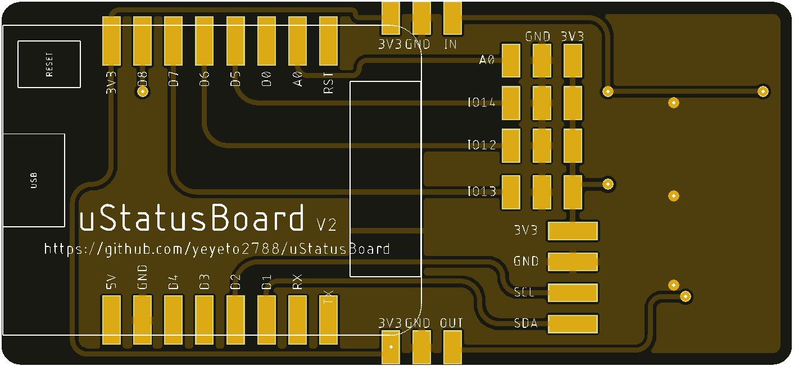
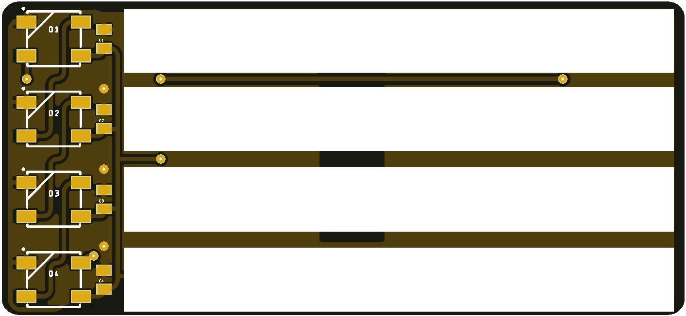

# uStatusBoard
The uStatusBoard is a board designed to be used as simple notifier with 4 leds WS2812B (aka NeoPixels) to show the status
by changing the color of the led on the board.

You can use a marker to write down the condition/status of anything you're monitoring.

**Top view of the board (latest version)**

<p align="center">

</p>

**Bottom view of the board (latest version)**

<p align="center">

</p>

In order to use the board we will need a Wemos D1 mini (image below) which the board is soldered onto it.

**Wemos D1 mini board**

<p align="center">

</p>


**Note:** There is no need to use specifically the Wemos D1 mini board, another board can used with this uStatusBoard.


## Structure for the Repository

```
Main Repository Folder(uStatusBoard)
        └── docs Folders
        |        |
        |        └── images folder
        └── examples Folder
        |   |
        |   └── example scripts
        |     
        ├── hardware Folder
        |     |
        |     └── version folders (Schematics and board design)
        |
        └── status_board.py (module)
        |
        └── README (This document.)
```

## Usage examples
To use the code (written in [MicroPython](https://micropython.org/)) we will just upload the module `status_board.py` and in the REPL we can start playing with it.

```console
>>> from status_board import StatusBoard
>>> board = StatusBoard()
>>> board.pin
Pin(15)
>>> board.brightness
255
```

Take into account that we are instantiated the object with the default attributes as seen in the REPL output above.

So now let's play a bit with it.

```console
>>> board.color_all('blue')
>>> board.color_all('red')
>>> board.color_all('green')
>>> board.color_all('white')
>>> board.color_all('nocolor')
```

This colors are defined on the `StatusBoard.colors` attribute which can be accessed any time

```console
>>> board.colors
{'cyan': [0, 1, 1], 'nocolor': [0, 0, 0], 'magenta': [1, 0, 1], 'blue': [0, 0, 1], 'yellow': [1, 1, 0], 'white': [1, 1, 1], 'green': [0, 1, 0], 'red': [1, 0, 0]}
```

Now let's turn off all the leds

```console
>>> board.clear_all()
```

If you want to know more about what methods the `StatusBoard` has head over to the [status_board.py](./status_board.py) script.

___
## Any feedback is highly appreciated! 

Please, if you see any error open an issue on this repo.

___
## Useful links:

[MicroPython](https://micropython.org/)
